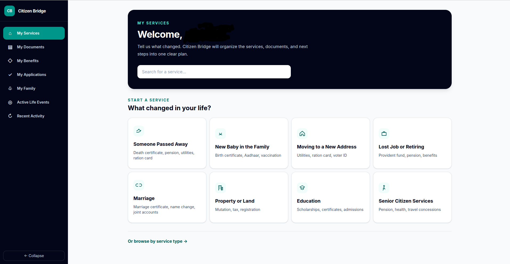

# Citizen Bridge

Your agent across all Indian public services.

## My Services



Citizen Bridge is moving from a FastAPI monolith to independently deployable
services using a strangler transition. The existing backend stays operational
while each route moves behind a shared gateway.

## Repository structure

```text
backend/         Legacy FastAPI application (kept during migration)
frontend/        Next.js application
services/        New services and the copyable Python service template
contracts/       Versioned gRPC, event, constant, and observability contracts
infrastructure/  Nginx and Kafka infrastructure assets
docs/            Architecture and transition documentation
```

The implementation order is defined in
[`docs/implementation-sequence.md`](docs/implementation-sequence.md). Shared
contract compatibility rules are in [`contracts/README.md`](contracts/README.md),
and route ownership is tracked in
[`docs/strangler-transition.md`](docs/strangler-transition.md).

## Prerequisites

- Python 3.11 or newer
- Node.js 20 or newer and npm
- Docker with Compose (optional)

## Run locally

Start the backend:

```bash
cd backend
python -m venv .venv
source .venv/bin/activate
pip install -e ".[dev]"
cp .env.example .env
uvicorn app.main:app --reload --env-file .env
```

The API is available at <http://localhost:8000>; `GET /health` returns
`{"status":"ok"}`.

The SQLite schema is created automatically during API startup. To apply
versioned migrations explicitly, run this from `backend/`:

```bash
alembic upgrade head
```

In a second terminal, start the frontend:

```bash
cd frontend
npm install
cp .env.example .env.local
npm run dev
```

Open <http://localhost:3000>. The page displays **Citizen Bridge** and the API
health status.

## Run checks

```bash
python -m unittest discover -s contracts/tests

cd backend
ruff check .
ruff format --check .
mypy app/
pytest
pytest --cov=app/core --cov-report=term-missing --cov-fail-under=80
```

```bash
cd frontend
npm run lint
npm run typecheck
npm test
npm run build
```

The backend suite covers dependency graphs and state transitions, approval gates,
all five adapters, document reuse, rejection/replanning, and the deterministic
`MOCK_AI=true` demo loop. Frontend tests render the intake, case overview, task
detail, dependency graph, loading, and error paths without external services.

## Run with Docker

Copy the documented local configuration, then start the production-like stack:

```bash
cp .env.example .env
docker compose up --build
```

With `.env.example`, the gateway is at <http://localhost:8080>, the frontend at <http://localhost:3000>,
and Jaeger at <http://localhost:16686>. PostgreSQL and Kafka data use named
volumes and survive container restarts. See
[`docs/configuration.md`](docs/configuration.md) for required variables.

Start all seven placeholder services behind Nginx with:

```bash
docker compose --profile services up --build
```

For bind-mounted source and hot reload in both services:

```bash
docker compose -f docker-compose.yml -f docker-compose.dev.yml up --build
```

Add `--profile services` to expose service HTTP ports `8001`–`8007` and gRPC
ports `50051`–`50057` during development. PostgreSQL is exposed on `5432` and
Kafka on `29092` only by the development override.

Stop either stack with `docker compose down`. Add `--volumes` only when you
intentionally want to remove persisted local data.
