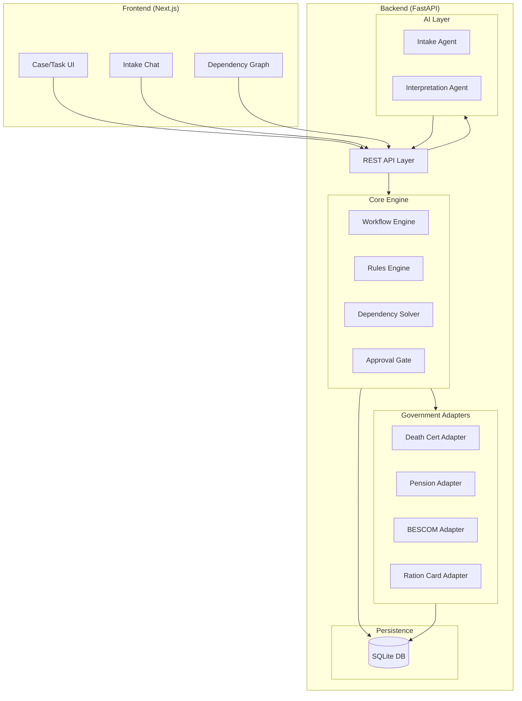
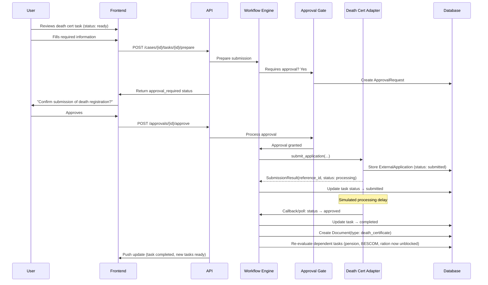
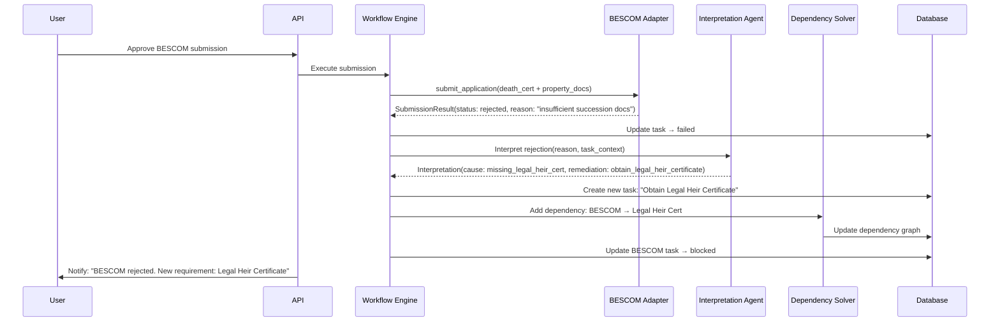

# Architecture — Citizen Bridge

## System Overview

Citizen Bridge is a **modular monolith** with a React frontend and Python/FastAPI backend. It orchestrates government service workflows through a deterministic workflow engine, using AI only for interpretation and ambiguity resolution.



## Architectural Boundaries

### 1. API Layer
- RESTful endpoints for all frontend interactions
- WebSocket for real-time case updates (P1)
- Request validation and error handling
- Session management (simple token, no auth for hackathon)

### 2. Core Engine (Deterministic)

#### Workflow Engine
- Loads workflow definitions (static YAML/JSON files)
- Creates task instances from templates when a workflow is activated
- Manages task state machine: `pending → ready → in_progress → submitted → completed | failed | blocked`
- Does NOT make decisions — only executes state transitions based on inputs

#### Rules Engine
- Evaluates workflow applicability: "Given this household profile, which workflows apply?"
- Checks document requirements: "Does this task have all required documents?"
- Validates eligibility: "Is the spouse eligible for family pension?"
- Pure functions: input → boolean/list output, no side effects

#### Dependency Solver
- Maintains a DAG (Directed Acyclic Graph) of task dependencies
- Computes task readiness: a task is "ready" only when all dependencies are satisfied
- Supports **dynamic dependency injection**: can add new edges at runtime (for replanning)
- Detects cycles (error condition)

#### Approval Gate
- Intercepts state transitions that are "consequential" (marked in workflow definition)
- Creates ApprovalRequest records
- Blocks task progression until user explicitly approves
- Records approval with timestamp for audit

### 3. AI Layer (Non-deterministic, Advisory)

#### Intake Agent
- Conducts conversational Q&A to understand the life event
- Extracts structured profile: who died, relationships, assets, location
- Uses OpenAI structured outputs to produce a typed `HouseholdProfile`
- **Boundary**: Produces a recommendation of applicable workflows; the Rules Engine validates

#### Interpretation Agent
- Called when an external adapter returns a rejection/failure
- Input: rejection message + task context
- Output: structured interpretation with proposed remediation action
- **Boundary**: Proposes changes; the Workflow Engine decides whether to accept

### 4. Government Adapters

All adapters implement a common interface:

```python
class GovernmentAdapter(Protocol):
    async def submit_application(self, application: ExternalApplication) -> SubmissionResult: ...
    async def check_status(self, reference_id: str) -> StatusResult: ...
    async def get_requirements(self) -> list[DocumentRequirement]: ...
```

For the hackathon, all adapters are **mocks** with configurable responses:
- Death Certificate: Always succeeds after simulated delay
- Pension: Succeeds (happy path)
- BESCOM: **Rejects first attempt** (missing legal heir cert), succeeds on retry with cert
- Ration Card: Succeeds (happy path)

Mock responses are defined in fixture files for deterministic testing.

### 5. Persistence

SQLite with migration-ready schema design:
- Use SQLAlchemy ORM with async support
- Alembic for migrations
- All queries go through repository pattern (swap SQLite → PostgreSQL by changing connection string)
- JSON columns for flexible metadata (workflow-specific fields)

## Data Flow

### Happy Path: Death Certificate



### Rejection & Replan: BESCOM



## Component Responsibilities Matrix

| Concern | Owner | NOT owned by |
|---|---|---|
| "What workflows apply?" | Rules Engine | AI (AI may suggest, Rules validates) |
| "Is this task ready?" | Dependency Solver | Frontend |
| "What documents are needed?" | Workflow Definition + Rules | AI |
| "What does this rejection mean?" | AI Interpretation Agent | Workflow Engine |
| "What should we do about it?" | AI proposes → WE executes | AI alone |
| "Has this task been submitted?" | Database (ExternalApplication) | LLM context |
| "Can we proceed?" | Approval Gate | Automatic |
| Task state transitions | Workflow Engine | API layer directly |
| Rendering and interaction | Frontend | Backend |

## Failure & Retry Model

1. **Adapter failures** (network, timeout): Retry with exponential backoff (max 3 attempts)
2. **Application rejections** (business logic): No retry — trigger interpretation → replan
3. **AI failures** (API error, malformed output): Graceful degradation — show raw rejection to user
4. **Database failures**: Transaction rollback, return 500
5. **Invalid state transitions**: Raise domain error, log, do not corrupt state

## Key Design Decisions

| Decision | Rationale |
|---|---|
| Modular monolith (not microservices) | Hackathon: simplicity, single deployment, fast iteration |
| SQLite (not PostgreSQL) | Zero setup, file-based, sufficient for demo; migration path via SQLAlchemy |
| Workflow definitions as code/YAML (not DB-stored) | Version-controlled, deterministic, easy to test |
| AI calls isolated behind typed interfaces | Mock for tests, swap models easily, limit blast radius |
| Frontend and backend in same repo | Monorepo simplicity for hackathon |
| REST (not GraphQL) | Simpler for the scope; fewer abstractions |
| Server-side state (not client-side) | Case must survive sessions; SSoT on server |
| OpenAI structured outputs | Reduce parsing ambiguity; typed responses |

## Directory Structure (Planned)

```
citizen-bridge/
├── backend/
│   ├── app/
│   │   ├── main.py              # FastAPI app entry
│   │   ├── api/                  # Route handlers
│   │   ├── core/                 # Workflow engine, rules, dependency solver
│   │   ├── models/               # SQLAlchemy models (domain)
│   │   ├── schemas/              # Pydantic schemas (API contracts)
│   │   ├── adapters/             # Government service adapters
│   │   ├── ai/                   # AI agent modules
│   │   ├── workflows/            # Workflow definition files (YAML)
│   │   └── db/                   # Database config, migrations
│   ├── tests/
│   ├── alembic/
│   └── pyproject.toml
├── frontend/
│   ├── src/
│   │   ├── app/                  # Next.js app router
│   │   ├── components/           # React components
│   │   ├── lib/                  # API client, utils
│   │   └── types/                # TypeScript types
│   ├── package.json
│   └── tailwind.config.ts
├── docs/
├── tickets/
└── PLAN.md
```
